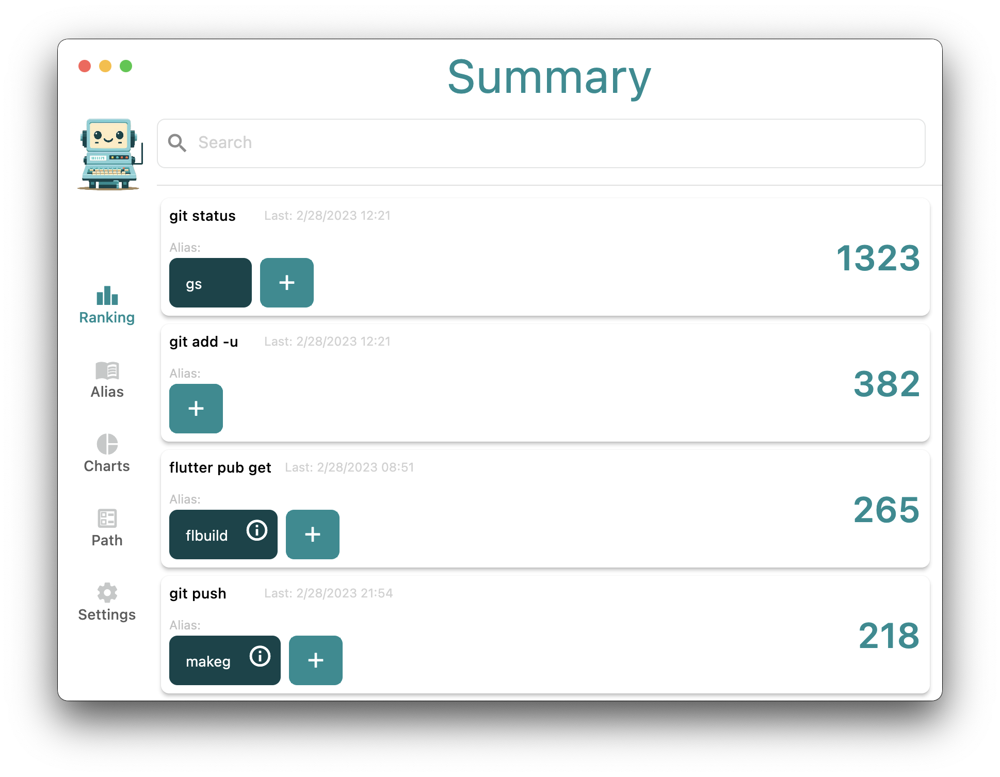
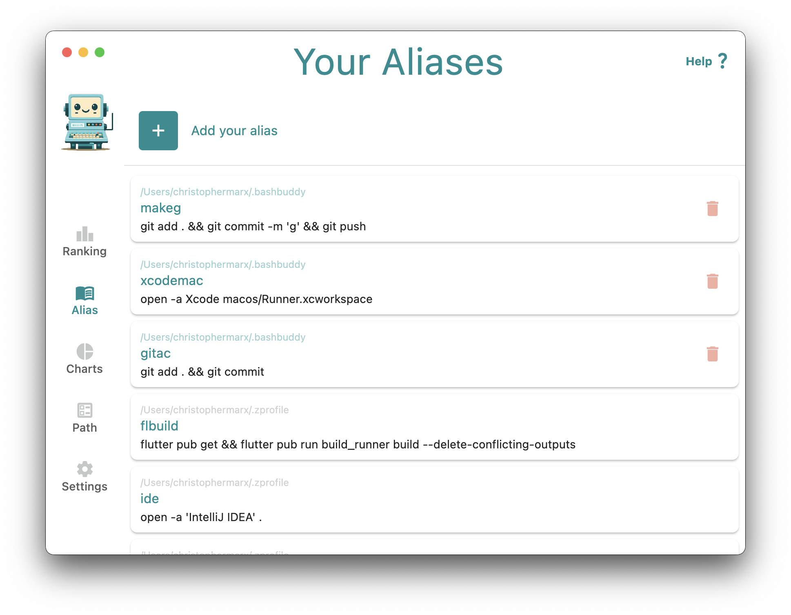
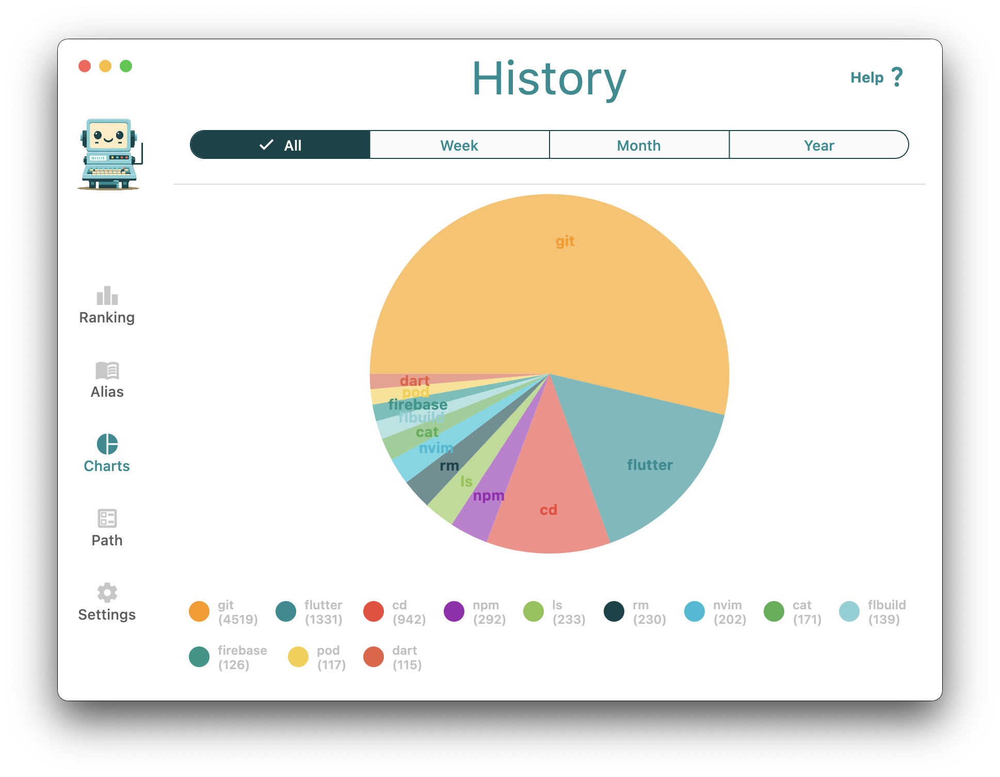
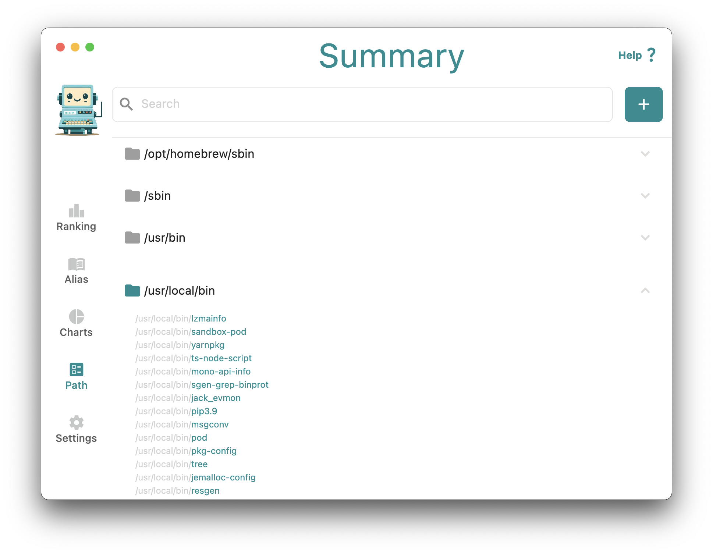

# Bash Buddy

A neat little Flutter MacOS app that helps you navigate the terminal.

This was originally a side project of mine, that I abandoned. I decided to clean it up a little bit and publish it to GitHub. I hope you enjoy it and maybe learn a thing or two.

## Screenshots

